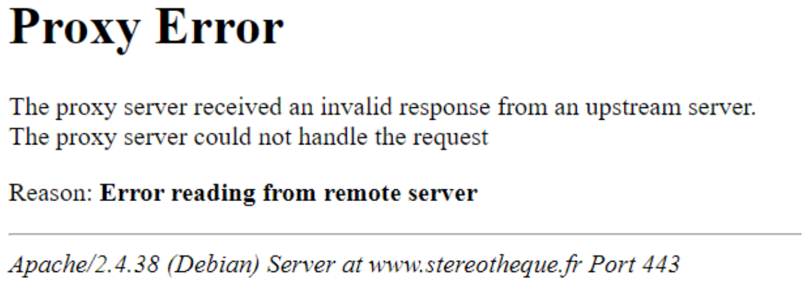
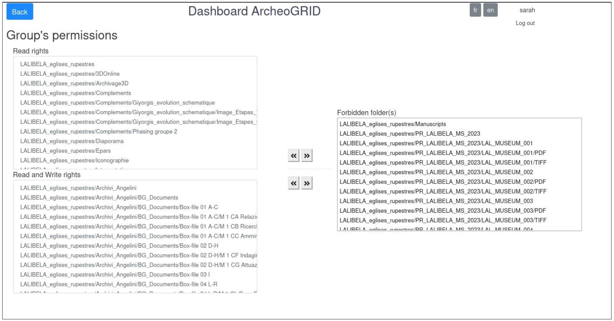

ArcheoGRID deposit procedure
===

Sustainable Lalibela Project


## 1. Preparation of the files


Naming files and folder according **project’s naming rules** if exist (no spaces, no special characters…).

Convert files in **open file format** if possible, to prepare for long term perservation.


## 2. Connect device on server

From the USB key or disk, plug it on the aglalibela server.


## 3. Copy data on project folders

In the terminal of the server, copy data on project folders.


Folder of the extern device:

- `/media/...`

Folders of the project:

- `/mnt/data/sustainablelalibela/LALIBELA_eglises_rupestres`
- or `/mnt/data/sustainablelalibela/Documentation`
- or any other folder for an existing project in `/mnt/data/sustainablelalibela`

Once the project has been identified, choose in which existing folder of the project the new data will be copied (use the data organization plan of the project if exist).

For instance, for the project Documentation, we want to add a new folder for new documents of year 2023 in the folder deposit. We create a folder 2023 in deposit folder:


``` bash
~/Documentation
~/Documentation/deposit
~/Documentation/deposit/2023 # (1)
~/Documentation/index
~/Documentation/metadata
```

1.  new folder to be created.


## 4. Synchronize data from dashboard admin in ArcheoGRID

To synchronize data, first choose the existing folder in which new data has been copied.

For instance, to synchronize the new folder 2023 who does not exist yet in database, select in the list, the parent folder: `deposit`

``` bash hl_lines="2"
~/Documentation
~/Documentation/deposit
~/Documentation/index
~/Documentation/metadata
```

To synchronize, data 3 options have to be decided:

**A/ choose Mode:**

1. Only folders
2. Only files
3. Folders and files

!!! tip

	Advise: If there is a lot amount of files, synchronize only folders at a first time (mode 1) and then files (mode 2) in 2 separated steps. If there isn’t too much data, mode 3 is suitable.

**B/ Choose delete mode or not (Yes/No)**

You can choose to delete in the database only (not on disks) the references that are no longer valid, if any.

!!! tip

	Advice: When files have been moved from a folder to another folder, it is good to delete no longer valid references to files when new data are synchronized. If the application scans folders on disk and is not able to read files any more, it will delete in the database the invalid file references.

**C/ Choose recursive mode or not (Yes/No)**

Recursive mode signify that the application will read recursively in every folders and subfolders. When the amount of files and folders isn’t too large (less than 500 files+folders), synchronization can be done recursively. The treatment is faster.

If recursive mode is chosen, the application computes the number of level to browse and ask the user to validate each level, just be clicking on the “execute” button.

!!! tip
	
	Advise: Less than 500 files and folders: recursive mode is recommended

Between 500 et 1000 files and folders, recursive mode is to be done carefully. If the disc readings are too long, the application can send error due to no response of the server. But this does not mean a real error, just a too long moment without response (the backen is just busy with synchronization).

<figure markdown="span">
  { width="500" }
</figure>

A work around, when the browser show the Proxy error like above, click on the left/back arrow of the browser and refresh page.

More than 1000 files+folders: avoid recursive mode or doing it at your own risk, strongly not recommended!


## 5. Set permissions for new folders

By default, new folders have « private » status: Only admin users can see them on the project’s page.


### Rights management by group (recommended)

Chose a group in the list

Then, move one or more folders from the forbidden folder list to one of the other set of folders, depending on the rights you want for them.

<figure markdown="span">
  { width="700" }
</figure>

By default, new folders are in the « forbidden folder(s) » box on the right. By using the arrows, you can either put folders in the “Read only” rights box or in the “Read-Write” rights box.


```
Forbidden folder(s) => Read only rights
					=> Read and write rights
```

Read and write rights on a folder means that user can edit and change the metadata of data located in this folder.

### Rights management on user level

If a user does not belong to any group or if a user must have specific rights, it is possible to set up rights by the user’s permission menu.

Choose a user in the list.

Then apply the same procedure as for managing group’s rights, moving folders from a rights box to another as required.

## 6. Check new folders and files in the project interface

Please note: a folder will be visible on the tree view of the project’s page only if it contains at least one file or at least one folder containing one file. It will not be displayed if it is empty.
