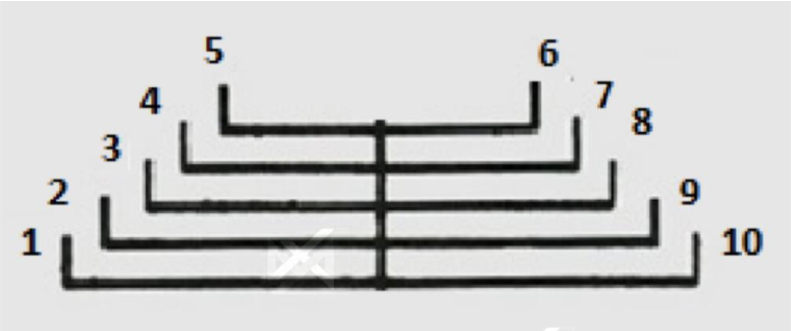
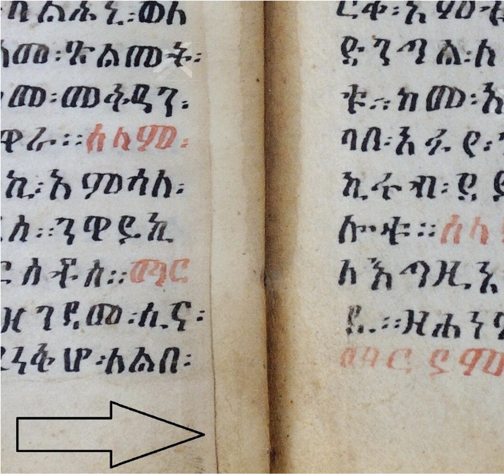
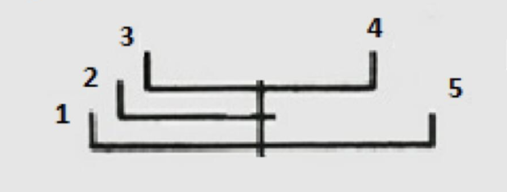

Preparing manuscripts for scanning
===

Before you start prepare a camera, movement register and a pencil

!!! warning

	Before taking manuscripts out from their storage, photograph disorganised collection (general shot). While taking manuscript out from its storage, record it in the movement register.

When arrived at the place at the working place take care for the following:

- Write your name and date in the *Register that names the person that prepares manuscript for scanning*.
- Use clean hands, do not put on gloves. 
- Arrange appropriate lighting. 
- Keep a template, a pentil, rubbers, a notebook, meter, scale and materials for cleaning and dusting ready.
- Avoid tea cups or water near the examination and documentation area.
- Turn over the pages gently. 
- Keep the manuscript on a flat support.

!!! note

	EVERYTHING must be scanned regardless of the condition of the manuscript, including loose or turn pages.

## 1. Give a call number

Give a call number according to the Sustainable Lalibela project system (Copy) 

!!! warning

	Note it only on the template, do not write anything on the book itself!

!!! example

	SL_MS_Lalibala_MD_001
	
	- `SL`: Sustainable Lalibela (invariable)
	- `MS`: Manuscript (depends on the type of the object)
	- `Lalibala`: depends on the ‘global’ provenance of the object
	- `MD`: Beta Madḫāne ʿĀlam (It depends on the church where the object is stored)
	- `001`: number of the object (please strart from 001 for every church collection)

Available churches codes – the system follows the first two radicals, or, in case of ambiguity, the first three:

- `MD`: Beta Madḫāne ʿĀlam
- `MS`: Beta Masqal
- `MR`: Beta Māryām
- `DN`: Beta Danāgǝl
- `GL`: Beta Golgotā
- `GY`: Beta Giyorgis
- `GB`: Beta Gabrǝʾel
- `AM`: Beta ʾAmānuʾel
- `LB`: Beta Libānos
- `MRQ`: Beta Mārqorewos) 

## 2. Evaluate the state of conservation

Evaluate the state of conservation of the book.

Depending on the condition of the book, you have three choices to evaluate it. If nothing is damaged, the conservation status is considered good. If the binding is damaged and further manipulation might cause additional harm, the conservation status is considered bad. If the binding is not damaged, but there are other issues and you believe the book can still be used for reading without any risk, then choose 'medium'. Evaluate critically, as books in poor condition require special care during scanning.

Sometimes the book is sewn too tightly, and opening the folios could cause damage to the parchment. Discuss with the project administrator, and if permission is granted, proceed to cut off the sewing.

## 3. Record the quire structure

Record the quire structure of the book.

The leaves of the quire are counted from left to right, over the centrefold, and referred to with the numbers 1, 2, 3, 4, etc.

!!! example "Schematic depiction of a quire consisting of 10 leaves (i.e. five bifolios, "quinion")"

	<figure markdown="span">
  		{ width="600" }
	</figure>
 
The number of leaves in the quire is normally even, but can frequently also be odd (1, 3, 5, etc.). In this case, it is necessary to indicate the positions of every single leaf and its stub (the short part of the single leaf that "hooks" it into the textblock), in relation to the other leaves of the quire. This is how stubs can look like in manuscripts:

!!! example

	<figure markdown="span">
  		{ width="600" }
	</figure>

This can be recorded in the following way:

- (number of the single leaf in the quire), stub before (number of the leaf in the quire following the stub)
- (number of the single leaf in the quire), stub after (number of the leaf in the quire preceding the stub)

The information about variations within the quire are given with reference to the number of a leaf within the quire, not to the general foliation. In some cases (esp. if you work on images), no stub can be detected. This can be recorded as:

!!! example "(number of the single leaf in the quire), no stub"

	<figure markdown="span">
  		{ width="600" }
	</figure>

 
The quire can include two or more single leaves even if the total number is even:
 

## 4. Measure outer parts of the book

We ask you to measure its height, width and thickness. Note all measurements in mm.

## 5. Weight the book

> If they have one. Voir dans une des malles.

## 6. Foliation

In case the book has not been foliated, you have to do it before digitalization.

For foliation, use only a **pencil**! 

Foliate each folio (the right page or recto) with text with numerals (1,2, 3…).

Once you have completed the template, please, **dust and clean the book**.

The aim is to improve the conservation of the book and to protect the scanner from dust, not to improve its appearance!

The dusting of boxes, manuscripts and documents can be done with a special vacuum cleaner, wipe or adapted brush.

Use the brush to clean the parchment leaves. Your movements should be from the center of the folio to its edges. Soft cloth or **sponge-type rubber** can replace the brush to an extent, as long as it’s not scented.

You can use the **white gum rubber** for miniatures, but your movements should be just to squeeze it to remove the upper layer of dirt, without effecting the layer of drawings themselves.

Parchment bindings are dusted and possibly gummed. Dusting is done with a vacuum cleaner equipped with a particle filter (control of the intensity of the suction) and/or a soft brush.

**Hand over the template and a manuscript to the scanning team.**

**(After digitilization, put aside manuscripts in bad state of conservation for treatment)**

